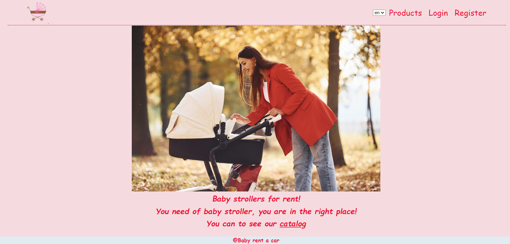
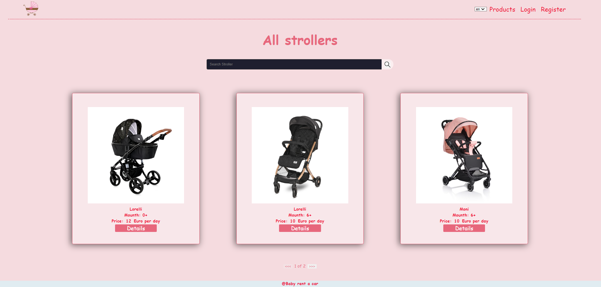
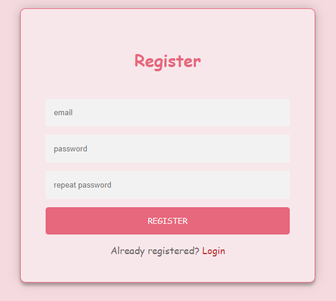
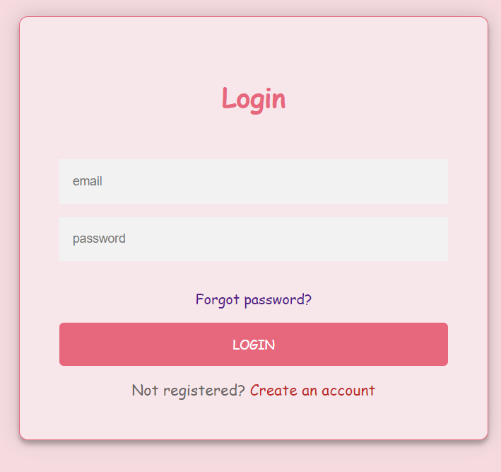
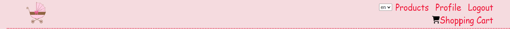
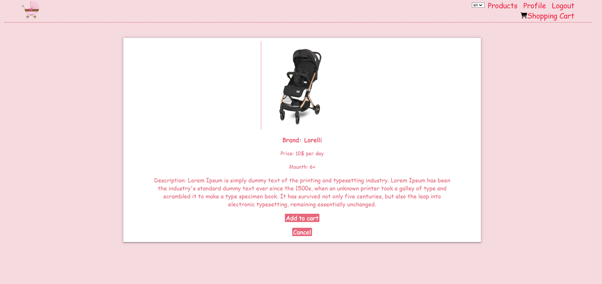
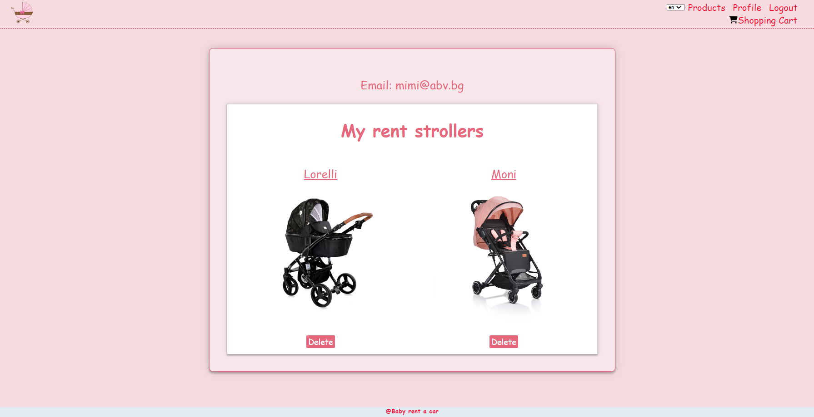

Angular project

This project was generated with Angular CLI version 16.1.1.
Run `ng serve` for a dev server. Navigate to `http://localhost:4200/`.

**Baby strollers rent**

This is online shop for rent baby strollers.

*Home page* for all users. Under the banner there is a link to catalog page for all users.
  

The application have public part and private part.   
The public part is visible without authentication, these are catalog of baby strollers, login and register pages.
  

*Catalog page*  
All users can see this page, there are all strollers that can be rented.
  

*Register page*  
Register form expect input email, password and repeat password. Valid inputs in this case are:  
The valid Email address must be example@example.example  
Password should be at least 6 symbols and max 25 symbols  
Repeat password and password must be matched  
All fields must be requered  

*login page*  
If user has a registration, can click on login and will be 
redirected to the Login page. The login form expects as input: email and password. Valid credentials in this case are:
The valid Email address must be example@example.example.
Password should be at least 6 symbols as well.

 
Private part is visible, after successful register and login.

Its have profil page for current user, page of every stroller with details and shopping cart.

*Details page*  
For every stroller have a details and can see it when click on details button from catalog page. If user want to rent this stroller, he can to add it to shopping cart or he can co click on cancel button and return ot catalog page

*Shopping cart*  
In shopping cart users can adds strollers from the catalog. They can continue shopping, rent stroller or remove stroller.

*Profile page*  
Every user can rent some strollers, if current stroller is alredy rent of user, he is don`t can rent it again. At profil of user render every strollers he is rent. The user can delete stroller, when he returned it.

